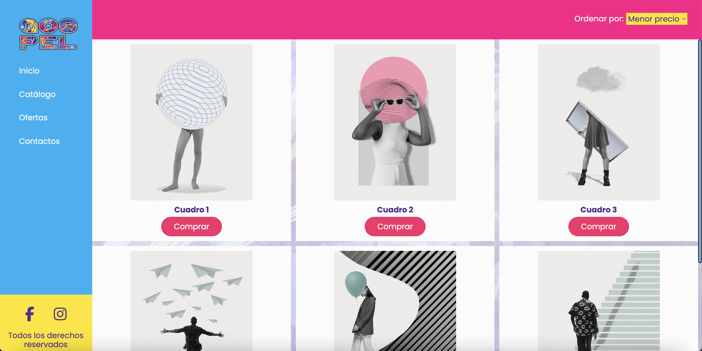

# Desafío 3 - Uso de Media Query - Módulo 2

En este desafío valida los conocimientos de media queries y breakpoints aplicados al diseño de layouts responsivos.

# prueba-animaciones-css
# prueba-animaciones-css
# prueba-modulo2
